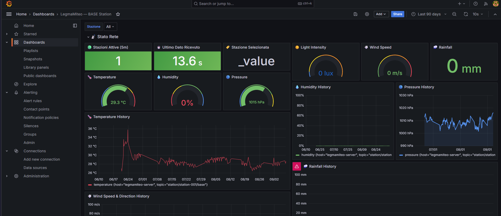

# 🌤️ LegmaMiteo — OpenWeather Station

[](https://firstdonoharm.dev/version/3/0/cl-eco-law-mil-sv.html)


An open-source, modular, and scalable weather station network designed for
real-time climate monitoring. Built with affordability and replicability in
mind — each unit costs under €200 and can be deployed anywhere.

🇮🇹 **[Leggi in italiano](README.it.md)**

---

## 🌍 Why This Project

Climate change is increasing the frequency and intensity of severe
convective weather — supercells, hailstorms, tornadoes — across Northern
Italy. National forecast models (ARPA, ECMWF, ICON) run at spatial and
temporal resolutions too coarse to nowcast these fast-developing,
localized events: by the time a model grid cell updates, the storm has
often already passed.

LegmaMiteo closes that gap with a dense, low-cost network of
micro-meteorological stations built for **nowcasting** — short-term,
hyperlocal prediction — focused initially on Lombardia. More stations
means finer-grained, faster-updating ground truth than any single
national model can provide, and an open dataset that grows with the
community deploying it. Existing weather station networks are sparse,
expensive, and often closed; LegmaMiteo aims to democratize severe
weather monitoring by enabling anyone to build, deploy, and contribute
data to a global open network.

---

## 📊 Live Dashboard

Real-time and historical data from `station-001`, visualized in Grafana:

<p align="center">
  
</p>

---

## ✨ Features

- **Modular design** — base unit + swappable expansion modules
- **Dual connectivity** — WiFi (primary) + LoRa mesh (remote areas)
- **Solar powered** — fully autonomous, no grid required
- **Self-hosted** — your data stays on your server
- **Open data** — all measurements publicly accessible via REST API
- **Under €200 per unit** — affordable and replicable worldwide

---

## 🧩 Modules

| Module | Sensors | Use Case | Status |
|--------|---------|----------|--------|
| **BASE** | BME280, VEML7700, Rain detector, Anemometer, Rain gauge | Everywhere | ✅ Deployed (station-001) |
| **MOD-AIR** | PMS5003, SCD40, ENS160+AHT21 | Urban / Industrial | 🚧 Dashboard ready, firmware WIP |
| **MOD-STORM** | AS3935, BMP580, GY-91, MLX90614BAA, TSL2591 | Storm monitoring | 🚧 Dashboard ready, firmware WIP |
| **MOD-HYDRO** | Ultrasonic level, flow sensor, turbidity | Rivers / Flood zones | 📋 Planned |
| **MOD-SOIL** | Capacitive moisture x3, DS18B20 | Agriculture / Forest | 📋 Planned |
| **MOD-SNOW** | VL53L1X, load cell, DS18B20, OV2640 | Mountain / Alpine | 📋 Planned |
| **MOD-FIRE** | Flame IR, MQ-7, MQ-2 | Mediterranean / Forest | 📋 Planned |
| **MOD-NOISE** | MEMS microphone SPH0645 | Urban / Industrial | 💡 Concept |
| **MOD-RAD** | ML8511 UV, Geiger tube | High altitude | 💡 Concept |

---

## 🏗️ Architecture

```
[ESP32-S3 Station]
      │
      ├── WiFi ──────────────────────▶ [MQTT Broker]
      │                                      │
      └── LoRa ──▶ [RPi LoRa Gateway] ───────┘
                                             │
                                       [Telegraf]
                                             │
                                       [InfluxDB]
                                             │
                                       [Grafana]
                                             │
                                       [REST API]
```

### Module connector — SP13 IP68 8-pin

All expansion modules connect to the base unit via a standardized
waterproof SP13 IP68 8-pin connector with the following pinout:

| Pin | Signal |
|-----|--------|
| 1 | VCC 3.3V |
| 2 | VCC 5V |
| 3 | GND |
| 4 | I2C SDA |
| 5 | I2C SCL |
| 6 | UART TX |
| 7 | UART RX |
| 8 | GPIO / Interrupt |

---

## 🛠️ Hardware Stack

- **MCU**: ESP32-S3
- **Connectivity**: WiFi 802.11 b/g/n + LoRa 868MHz (CDEBYTE E22-900M22S)
- **Power**: 10W solar panel + LiFePO4 battery + MPPT controller
- **Enclosure**: IP66 box + 3D printed Stevenson screen
- **Module connector**: SP13 IP68 8-pin (JST-XH 8-pin internal)

---

## 💻 Server Stack

- **MQTT Broker**: Mosquitto (with password authentication)
- **Time-series DB**: InfluxDB 2.x
- **Visualization**: Grafana
- **Bridge**: Telegraf
- **REST API**: FastAPI (Python)
- **All containerized**: Docker Compose

---

## 🌐 REST API

The public REST API exposes real-time and historical data from all stations.

**Base URL**: `http://localhost:8000` (or your Cloudflare tunnel URL)

| Endpoint | Description |
|----------|-------------|
| `GET /` | API info |
| `GET /health` | Health check |
| `GET /stations/` | List all active stations |
| `GET /stations/{id}` | Station metadata |
| `GET /data/{id}/latest?module=base` | Latest reading from a station |
| `GET /data/{id}/history?field=temperature&range_hours=24` | Historical data |
| `GET /data/{id}/alerts` | Active alert conditions |

**Example — latest data from station-001:**
```bash
curl http://localhost:8000/data/station-001/latest
```
```json
{
  "success": true,
  "station_id": "station-001",
  "module": "base",
  "data": {
    "temperature": 29.7,
    "humidity": 61.8,
    "pressure": 1017.6,
    "lux": 63261.0,
    "wind_speed": 29.2,
    "wind_direction": 51.0,
    "rain_mm": 1.2
  }
}
```

Full interactive documentation at `/docs` (Swagger UI).

Data is released under **CC BY-NC 4.0**. AI/ML training use is prohibited without explicit written permission.

---

## 🔔 Alert System

Grafana-based alerting with Telegram notifications. Active alert rules:

| Alert | Condition | Severity |
|-------|-----------|----------|
| 🌡️ High Temperature | temperature > 35°C | Warning |
| 😷 Critical PM2.5 | pm25 > 55 µg/m³ (WHO threshold) | Critical |
| 🏭 High CO2 | co2 > 1000 ppm | Warning |
| ⚡ Lightning Nearby | lightning_distance < 10 km | Critical (immediate) |
| 🌩️ Rapid Pressure Drop | pressure drop > 3 hPa / 30 min | Warning (storm incoming) |

---

## 🚀 Getting Started

### Option 1 — Standalone server package (recommended)

The fastest way to get a server running on a **Raspberry Pi, Linux box, or
Windows PC** — no manual Docker setup needed. Download the latest release
package, which includes an installer that generates secure random
credentials for you automatically:

👉 **[Latest release](https://github.com/Dragonyx118/LegmaMiteo/releases/latest)**

```bash
# Linux / Raspberry Pi
tar -xzf LegmaMiteo-server.tar.gz
cd LegmaMiteo-server
chmod +x install.sh
./install.sh
```

```powershell
# Windows (PowerShell, with Docker Desktop running)
Expand-Archive LegmaMiteo-server.zip
cd LegmaMiteo-server
Set-ExecutionPolicy -Scope Process -ExecutionPolicy Bypass
.\install.ps1
```

The installer prints the generated admin credentials and URLs at the end —
save them somewhere safe.

### Option 2 — Clone the full repo (for development)

```bash
git clone https://github.com/Dragonyx118/LegmaMiteo
cd LegmaMiteo/server
docker compose up -d
```

Then open:
- Grafana: http://localhost:3000
- InfluxDB: http://localhost:8086

⚠️ This path does **not** generate credentials automatically. Set your own
`INFLUXDB_ADMIN_PASSWORD`, `GRAFANA_ADMIN_PASSWORD`, and `INFLUX_TOKEN` in a
`server/.env` file before running `docker compose up` — never commit real
credentials to the repo. See `server/telegraf/telegraf.conf.example` and
`firmware/base/*/src/secrets.h.example` for the files you need to copy and
fill in locally.

### Firmware

Documentation coming soon.

### Hardware

Schematics and PCB files coming soon.

---

## 📡 Data Policy

All data collected by this network is released under
**Creative Commons Attribution-NonCommercial 4.0**.

The following uses are **strictly prohibited**:
- Military or defense applications
- Weapons systems or targeting
- Mass surveillance or individual profiling
- AI/ML training without explicit written permission
- Any use intended to cause harm to people or communities

See [DATA_POLICY.md](DATA_POLICY.md) for full details.

---

## 🤝 Contributing

Contributions are welcome! Please read
[CONTRIBUTING.md](CONTRIBUTING.md) before submitting pull requests.

By contributing you agree to uphold the ethical guidelines of this project.

---

## 📄 License

This project is licensed under the
**Hippocratic License HL3-CL-ECO-LAW-MIL-SV** — see [LICENSE](LICENSE) for details.

Modules included:
- **CL** — Copyleft
- **ECO** — Ecocide
- **LAW** — Law Enforcement
- **MIL** — Military Activities
- **SV** — Mass Surveillance

---

## 👤 Author

[Dragonyx](https://github.com/Dragonyx) — built with ❤️ for the planet.